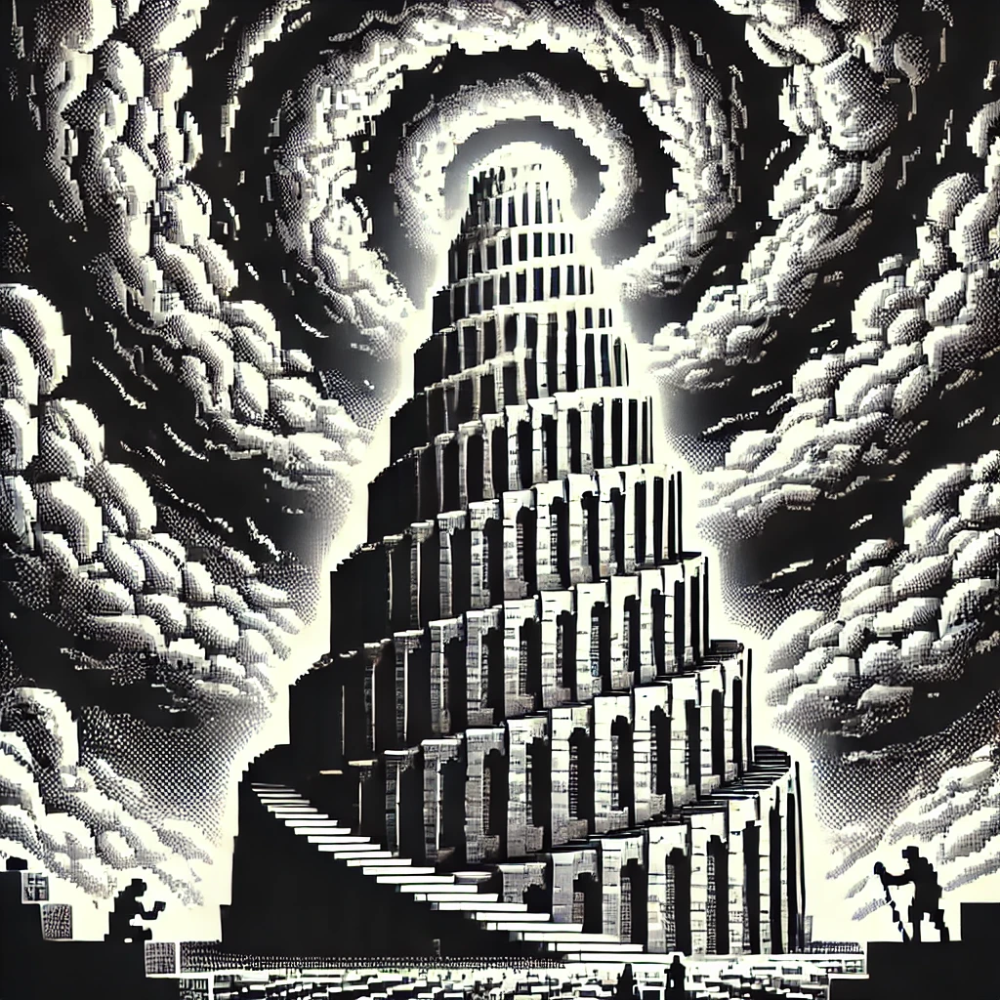
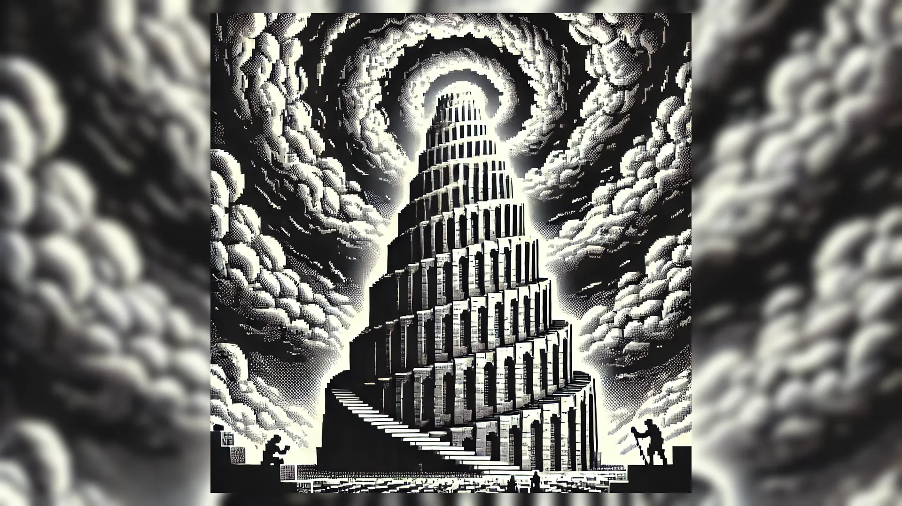
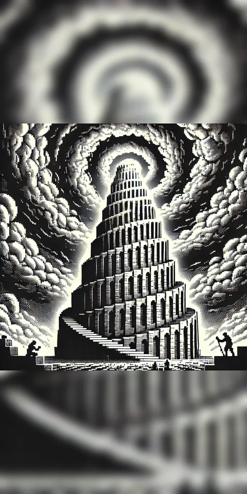
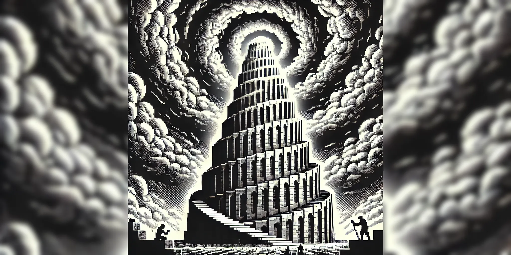
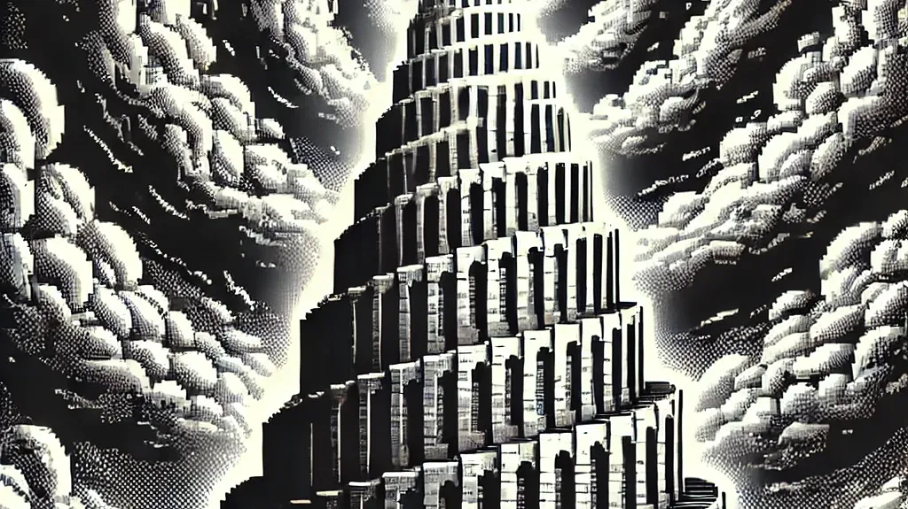

# Thumber

Create thumbnails. Specify dimensions or aspect ratio. If the aspect ratio from the input image is altered, fills the background with the same image, but blurred. Alternatively, just crop it without blur.

Install using pip:

```
pip install thumber
```

## Usage

```
thumber direct <input_image> <final_width> <final_height> [--blur <blur_radius>]

thumber aspect <input_image> <ratio> [--blur <blur_radius>]

thumber crop <input_image> {--ratio <aspect_ratio> | --width <crop_width> --height <crop_height>}
```


Values for `<mode>`:
 
- `dimensions`
- `aspect`
- `crop`


Examples:

- Produce a 1920x1080 image:

```
thumber dimensions image.png 1920 1080 --blur=30
```

- Produce an image whose width is 1.778x the height:

```
thumber aspect image.png 1.778 --blur=30
```

The closer to 0, the lower is the blur effect


- Produce a cropped image, without blur in the background:

```
thumber crop image.png --ratio=1.778
```

```
thumber crop image.png --width=1920 --heigth=1080
```

## Gallery Examples


| `babel.webp` (1024x1024)| `babel-dimensions-1920x1080.webp` | `babel-aspect-0.5.webp` | `babel-aspect-2.webp` | `babel-cropped-1920x1080.webp`|
|:----:|:----:|:-----:|:----:|:----:|
| |  |  |  | 


## License 

This project is licensed under the MIT License.
